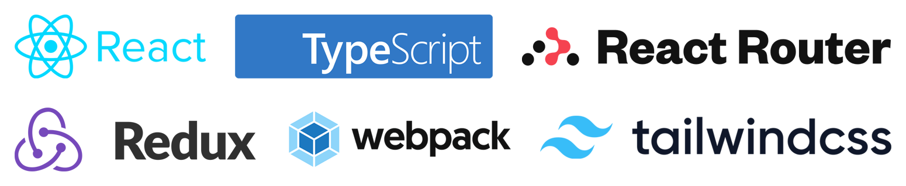

# React-Redux Boilerplate



The Boilerplate to start React+Redux project with TypeScript in an easier and faster way to get started with developing React apps with routing, state management, and other useful goodies . It is based on the boilerplate originally made by vannizhang from this repo: https://github.com/vannizhang/react-redux-boilerplate.git.

There are certain additions though. This boilerplate uses the Redux Toolkit (which is recommended to be used as the correct way to use Redux by the Redux team itself). Also React Router has been added and configured.

## Features

- React
- Redux (Toolkit (the recommended way according to Redux))
- TypeScript
- Webpack
- Jest
- Tailwind
- EsLint
- Prettier
- React Router

## What's included on top of [the original boilerplate](https://github.com/vannizhang/react-redux-boilerplate)

- This boilerplate has a complete Redux store set up using [the Redux Toolkit](https://redux-toolkit.js.org/). Along with the Redux store, there are two example slices. Read more about slices in the [Redux docs](https://redux-toolkit.js.org/usage/usage-guide#creating-slices-of-state). One slice (counterSlice) is a slice that can increment and decrement a number. The other slice (toggleSlice) is a simple toggling functionality that toggles between true and false (boolean value).
- There is also a complete configured React Router instance included. There are two routes: `/` (home) and `/two` (a simple example page with no functionality).

## Getting Started

1. Make sure you have a fresh version of [Node.js](https://nodejs.org/en/) and NPM installed. The current Long Term Support (LTS) release is an ideal starting point

2. Clone this repository to your computer: 
    ```sh
    git clone https://github.com/erolsmsr58/react-redux-typescript-boilerplate.git
    ```


3. From the project's root directory, install the required packages (dependencies):

    ```sh
    npm install
    ```

4. To run and test the app on your local machine (http://localhost:8080):

    ```sh
    # it will start a server instance and begin listening for connections from localhost on port 8080
    npm run start
    ```

5. To build/deploye the app, you can run:

    ```sh
    # it will place all files needed for deployment into the /dist directory 
    npm run build
    ```

## Project Structure

```sh
├── public  
    ├── favicon.ico
    ├── index.html              # html template for the app
├── src                         # Source code.
    ├── components              # reusable UI components
        ├── ArcGIS              # building blocks for the Map Interface with ArcGIS API for JavaScript (e.g. MapView, Search Widget and tec)
    ├── constants               # app-wide constants (text, URLs, themes and etc)
    ├── contexts                # React contexts
    ├── hooks                   # reusable custome hooks
        ├── useAppDispatch      # correctly typed dispatch for Redux
    ├── pages                   # Page components
    ├── router                  # router related files
        ├── router.ts           # router configuration
    ├── services                # API calls
    ├── static                  # static assets
    ├── store                   # Redux store
        ├── store.ts            # Redux store configuration (using configureStore())
        ├── features            # folder containing the slices (including initial state, reducers and actions)
            ├── counter         # counter slice
            ├── toggle          # toggle slice
    ├── styles                  # app-wide styles
    ├── types                   # type definitions
        ├── storeTypes.ts       # type definitions for the Redux store
    ├── utils                   # utility functions
    └── index.tsx               # entry point for the app
├── .babelrc                    # Babel configuration
├── .eslintrc.js                # ESLint configuration
├── .prettierrc.js              # Prettier configuration
├── tsconfig.json               # TypeScript configuration
├── webpack.config.js           # Webpack configurations
├── tailwind.config.js          # Tailwind CSS configurations
├── postcss.config.js           # PostCSS configurations
```

## Issues
Find a bug or want to request a new feature? Please let me know by submitting an issue.

## Licensing
Copyright 2023 erolsmsr58

Licensed under the Apache License, Version 2.0 (the "License");
you may not use this file except in compliance with the License.
You may obtain a copy of the License at

   http://www.apache.org/licenses/LICENSE-2.0

Unless required by applicable law or agreed to in writing, software
distributed under the License is distributed on an "AS IS" BASIS,
WITHOUT WARRANTIES OR CONDITIONS OF ANY KIND, either express or implied.
See the License for the specific language governing permissions and
limitations under the License.
